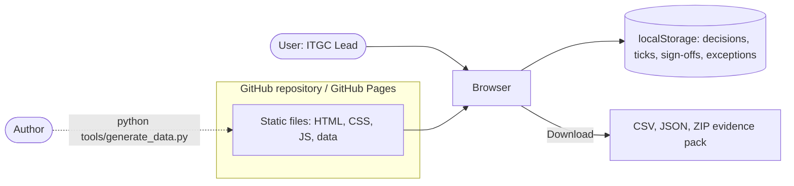
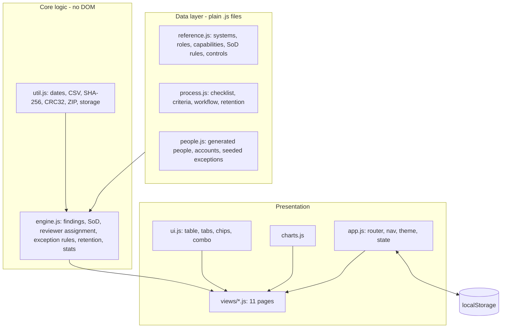
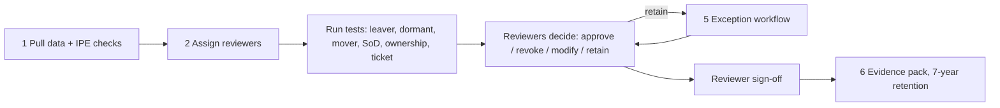
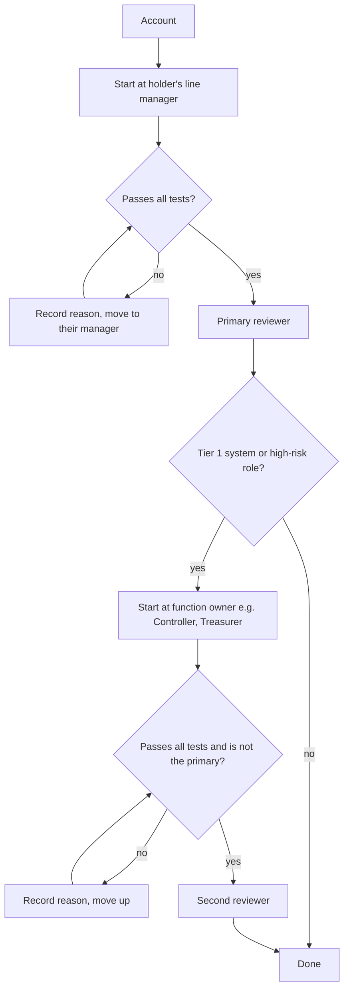
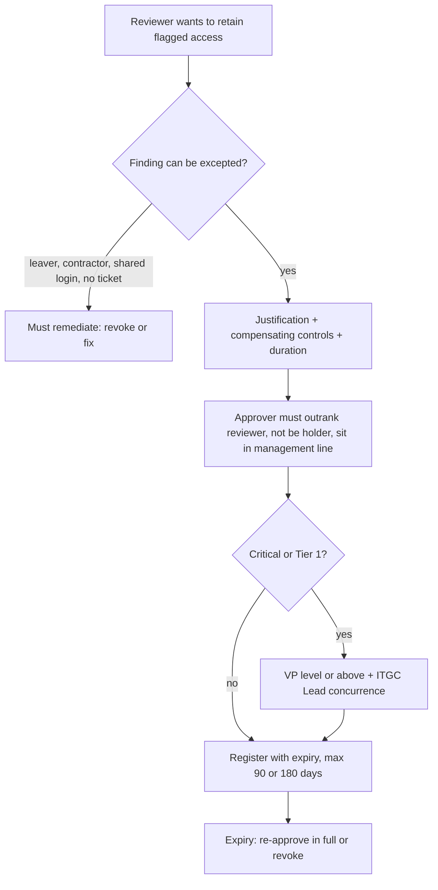

# High-Level Design (HLD)

**Project:** SOX Access Review Lab
**Type:** Static, client-side web application (no backend)
**Status:** Complete, synthetic data only

## 1. Purpose

Turn the Day 15 GRC assignment ("Design an access review checklist, SOX-aligned") from a 700 to 1000 word document plus a table into a working website that performs every task the assignment asks for and demonstrates each success criterion with live data.

The user plays the **ITGC Lead** of a fictional company, KaizenMotors, running a quarterly user-access review across four systems.

### Assignment tasks the system must fulfil

| # | Task | Realised as |
|---|---|---|
| 1 | Access review checklist: what data to pull and from where | Checklist page with source, method, IPE check and owner per item |
| 2 | Reviewer assignment | Rule-based assignment engine, escalation log, override tester |
| 3 | Review criteria per system | Criteria page and role catalogue |
| 4 | SoD conflict rules (3 examples minimum) | 14 transaction-level rules plus role-combination checker |
| 5 | Exception approval workflow | Wizard, register and automatic audit of the register |
| 6 | Evidence retention for the auditor | Retention calculator and downloadable, hashed evidence pack |

### Success criteria (from the assignment) and the design response

| Criterion | Design response |
|---|---|
| SoD conflicts are specific transactions | A rule is a pair of *capabilities*; each capability carries the exact screen path. No rule is written in terms of job titles. |
| Reviewer assignment excludes self-review | Assignment is a chain walk with hard rejection tests; a second pass re-validates every result. |
| Exception approval ranks above reviewer's role | Approver eligibility is computed from numeric grade levels and enforced both when creating and when auditing exceptions. |
| Evidence retention meets 7-year rule | Retention calculator refuses fewer than 7 years; evidence pack manifest stamps the retain-until date. |
| Blackline and Kyriba get higher scrutiny | System tier attribute drives dual review of every user, shorter exceptions and CFO-level approval. |
| GitHub prod-DB access flagged as SoD risk | Rule R04 (code-write versus production-DB read), Critical. |

## 2. Constraints that shaped the design

1. **Must run on GitHub Pages with no backend.** Everything happens in the browser.
2. **Must be uploadable by drag-and-drop from a folder.** No build step, no `node_modules`, no generated bundles to keep in sync. Fewer than 100 files.
3. **Should work from `file://`.** Double-clicking `index.html` must work. Browsers block `fetch()` of local JSON and treat ES modules from `file://` as cross-origin, so the app uses classic `<script>` tags and data as `.js` files.
4. **No real data.** Everything is generated. Nothing is transmitted.
5. **Python venv is available; Node is not.** Python is used for data generation and validation only, never at runtime.

## 3. System context

There is no server, database, authentication or API. The only persistence is the browser's `localStorage`, and the only output is files the user downloads.

## 4. Architecture

Layers depend only downward. `engine.js` never touches the DOM, which is what makes `tests.html` possible.

### 4.1 Components

| Component | Responsibility |
|---|---|
| **Reference data** | The authoritative catalogue: four systems, 45 roles, 42 capabilities with screen paths, 14 SoD rules, 15 compensating controls. Single source of truth for both the browser and the Python tools. |
| **Process data** | Hand-written content for the six tasks: 31 checklist items, per-system criteria, 8-step exception workflow, retention artefacts, auditor request list, review calendar. |
| **People data** | 398 generated people, 505 accounts, 7 seeded exceptions, with deliberately planted issues. |
| **Engine** | Joins the data, raises findings, detects SoD conflicts, assigns reviewers, audits exceptions, computes retention and statistics. |
| **Views** | Home, Analysis, Checklist, Reviewers, Criteria, SoD, Exceptions, Evidence, Workbench, Accounts, Report. |
| **State** | Small JSON object in `localStorage` (checklist ticks, workbench decisions, sign-offs, user exceptions). |
| **Tools (Python)** | `generate_data.py` builds the population; `validate_data.py` independently recomputes findings and checks structure. |

## 5. Key flows

### 5.1 Review cycle as modelled

### 5.2 Reviewer assignment

Tests (any failure rejects): is the holder or owner; has left; below Manager level; does not outrank the holder; administers the system.

### 5.3 Exception approval

## 6. Design decisions and trade-offs

| Decision | Reason | Trade-off |
|---|---|---|
| Vanilla JavaScript, no framework or bundler | Upload-and-go; nothing to build; easy to read and audit | More hand-written DOM code |
| Classic scripts and `.js` data (not ES modules or JSON) | Works from `file://` and on GitHub Pages identically | Global namespace `window.KAI`; order of `<script>` tags matters |
| Reference data is strict JSON inside a `.js` wrapper | Python can read it with a one-line regex, so both sides share one catalogue | Cannot contain comments |
| Findings are computed in the browser, not stored | Numbers can never disagree with the rules; changing a rule updates every page | Recomputed on load (about 5 ms) |
| Python generator with fixed seed, output committed | Reproducible data; no runtime dependency on Python | Regeneration is a manual step |
| Independent Python re-implementation of findings | Catches logic errors in the engine; counts must match to the digit | Two implementations to keep in step |
| Capabilities, not roles, are the SoD unit | A role change or new role cannot silently open a conflict; rules are transaction-level | Requires a role-to-capability map |
| Identity-level SoD across systems | Finds conflicts invisible to per-system reviews (Oracle payment run plus Kyriba release) | Needs one person id across systems |
| Hand-drawn SVG/CSS charts | No CDN dependency; works offline | Only the chart types needed |
| SHA-256 and ZIP written in about 100 lines | Works on `file://` where `crypto.subtle` may be unavailable; no library | Own code to maintain (covered by tests and checked against Python's `zipfile`) |
| Sign-off saved in `localStorage` | No backend allowed | Not tamper-proof; stated clearly as a simulation |

## 7. Non-functional considerations

- **Privacy and security:** no network calls, no analytics, no cookies. The only untrusted input is text the user types. It is always inserted as a text node; the DOM helper has no `innerHTML` path, so there is no injection surface.
- **Performance:** 505 accounts and about 130 findings; every page renders in a few milliseconds. Tables page at 40 to 60 rows.
- **Accessibility:** semantic tables and headings, labelled controls, focus outlines, skip link, colour never the sole signal (severity has text), light and dark themes, works down to phone width.
- **Portability:** any modern browser; no server. Print stylesheet produces a clean PDF from the report page.
- **Maintainability:** one file per page, pure engine, tests in `tests.html`, generator and validator in `tools/`.
- **Determinism:** the generator uses a fixed seed; the same repo always shows the same numbers.

## 8. Deployment

Upload the folder contents to a GitHub repository, enable Pages (branch `main`, root), and the site is live at `https://<user>.github.io/<repo>/`. All paths are relative so the repository sub-path is not a problem. There is no CI, build, or environment configuration.

## 9. Risks and limitations

| Risk | Mitigation |
|---|---|
| Simulation presented as a real control | README and footer say it is synthetic; sign-off and pack are labelled as browser-side |
| Retention period differs under local law | Retention page warns that Indian company law may require longer and says to confirm with Legal |
| Planted findings make the company look unrealistically leaky | Deliberate: the exercise needs something to find. Rates by system are reported honestly, including where Tier 1 is not worse |
| Two implementations of the finding rules could drift | `validate_data.py` and `tests.html` assert identical counts |
| `localStorage` blocked or cleared | Storage wrapper falls back to memory; nothing is required to persist for the pages to work |

## 10. Out of scope

Real authentication or multi-user workflow, integration with real systems (Oracle, Blackline, Kyriba, GitHub APIs), tamper-proof signatures, and any real personal data.
